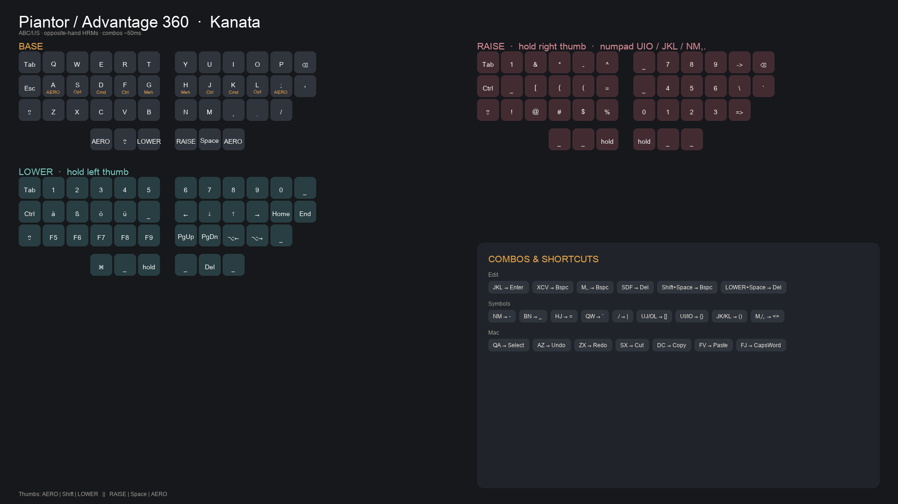
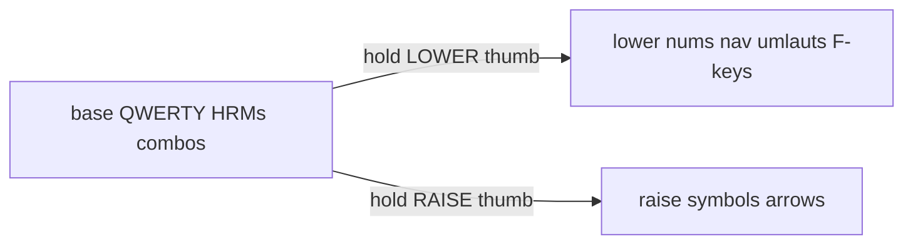

# Layout cheat sheet (Piantor / Advantage 360 → Kanata)



macOS, ABC/US input source. Config: [`advantage360.kbd`](advantage360.kbd).

## Thumbs (Adv360 via SmartSet F-keys / Piantor native)

```
Outer → inner          Inner → outer
AERO | Shift | LOWER  ||  RAISE | Space | AERO
 f15    f17     f13        f14    spc    f16
```

| Role | Action |
|------|--------|
| LOWER thumb | hold → numbers, nav, umlauts, F-keys, **Bspc/Del** |
| RAISE thumb | hold → symbols, `->` / `=>` |
| AERO | Opt+Cmd (window manager) |
| Shift | Shift (on LOWER: this thumb becomes **Backspace**, hold to repeat) |
| Space | Space |

| Shortcut | Action |
|----------|--------|
| **Shift + Space** (thumb or pinky Shift) | Backspace (hold to repeat) |
| **LOWER + Space** | Delete (hold to repeat) |

**Laptop helpers:** hold Caps or right Opt → LOWER · hold `'` → RAISE · tap Caps → Esc · tap `'` → `'`

## Home-row mods (hold = mod, tap = letter)

| Key | Hold |
|-----|------|
| A | AERO (Opt+Cmd) |
| S | Opt |
| D | Cmd |
| F | Ctrl |
| G | Meh |
| H | Meh |
| J | Ctrl |
| K | Cmd |
| L | Opt |
| ; | AERO |

Opposite-hand only (timeless HRMs). Same-hand rolls stay letters.

---

## Combos (base)

Press together quickly (~50ms).

### Editing
| Combo | Output |
|-------|--------|
| J K L | Enter |
| X C V | Backspace |
| M , . | Backspace |
| S D F | Delete |
| Tab Esc Shift | Lock screen |

### Symbols
| Combo | Output |
|-------|--------|
| N M | `-` |
| B N | `_` |
| H J | `=` |
| Q W | `` ` `` |
| . / | `\|` |
| U J | `[` |
| O L | `]` |
| U I | `{` |
| I O | `}` |
| J K | `(` |
| K L | `)` |
| M , | `<` |
| , . | `>` |

### Clipboard / edit (Cmd)
| Combo | Output |
|-------|--------|
| Q A | Select all |
| A Z | Undo |
| Z X | Redo |
| S X | Cut |
| D C | Copy |
| F V | Paste |
| F J | Caps Word |

---

## LOWER (hold thumb / Caps / right Opt)

```
Tab  1  2  3  4  5     6  7  8  9  0
Ctrl ä  ß  ö  ü  _     ←  ↓  ↑  →  Home End
Shift F5 F6 F7 F8 F9   PgUp PgDn ⌥← ⌥→
```

| Keys | Output |
|------|--------|
| A S D F | ä ß ö ü (Shift → Ä Ö Ü) |
| H J K L | ← ↓ ↑ → |
| ; ' | Home End |
| N M | PgUp PgDn |
| , . | Word left / word right (Opt+←/→) |
| Z X C V B | F5–F9 |
| Q–T / Y–P | 1–5 / 6–0 |

---

## RAISE (hold thumb / hold `'`)

```
Tab  1  &  *  -  ^      _  7  8  9  →  ⌫
Ctrl _  [  {  (  =      _  4  5  6  \  `
Shift !  @  #  $  %     0  1  2  3  =>
```

Right-hand numpad (RAISE):

| | | |
|---|---|---|
| U 7 | I 8 | O 9 |
| J 4 | K 5 | L 6 |
| N 0 | M 1 | , 2 | . 3 |

| Notable | Key |
|---------|-----|
| `->` | `P` |
| `=>` | `/` |
| `$` `&` | `V` / `W` (shifted symbols row) |

Bracket/paren combos on base often faster than RAISE.

---

## Quick recipes

| Need | How |
|------|-----|
| `snake_case` | `b+n` → `_` |
| PHP/TS `->` | RAISE + `P` |
| TS/Rust `=>` | RAISE + `/` |
| bash `\|` | `.+/` combo |
| template `` ` `` | `q+w` combo |
| German | LOWER + `a s d f` |
| nvim jump word | LOWER + `,` / `.` |
| arrows | LOWER + `H J K L` |

---

## Layers overview


